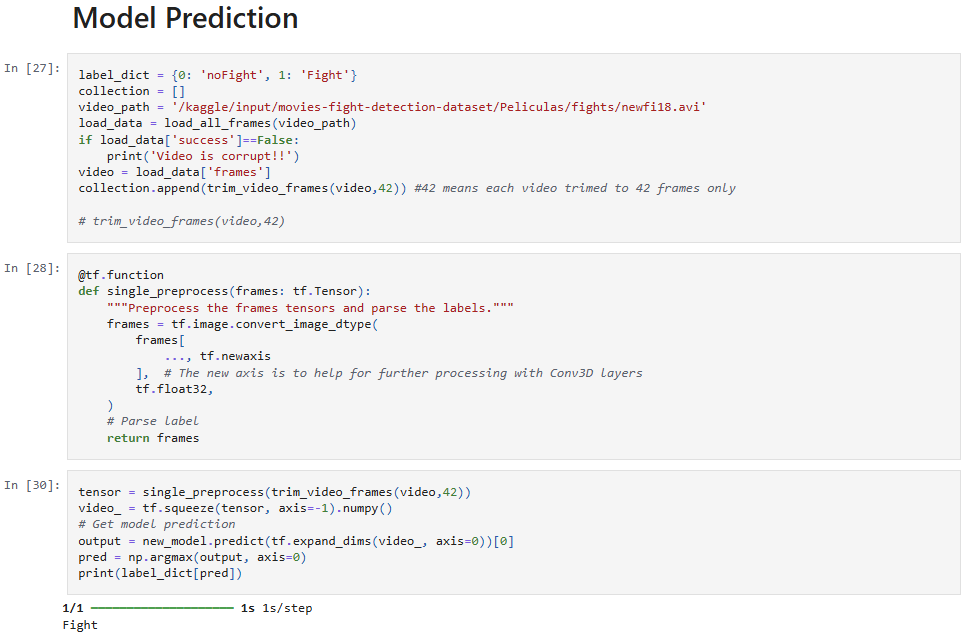

# 🔍 Fight Detection in Videos using ViViT Transformer

## 📌 Project Overview

This project demonstrates an application of deep learning in **video classification** by detecting whether a given video clip contains a *fight* or *no fight* scene. The model utilizes a **Video Vision Transformer (ViViT)** architecture trained on a real-world movie dataset.

---

## Model Results

---

## 📁 Dataset

**Source**: [Kaggle - Movie Fight Detection Dataset](https://www.kaggle.com/datasets/naveenk903/movies-fight-detection-dataset/data?select=Peliculas)

### Classes (Targets):
- `1` → **Fight**
- `0` → **No Fight**

---

## 🎯 Objective

To build a deep learning model that can:
- Process short video clips.
- Classify them as "Fight" or "No Fight" accurately.
- Visualize predictions on unseen test samples.
- Predict custom movie scenes dynamically.

---

## 🧠 Model Architecture

The model is based on the **ViViT (Video Vision Transformer)**, an advanced transformer-based architecture for spatio-temporal video understanding.

### Key Features:
- **Tubelet Embedding** using 3D Convolutions.
- **Positional Encoding** to capture temporal information.
- **Transformer Encoder Layers** with Multi-Head Attention.
- Final dense classifier with Softmax activation.

---

## ⚙️ Tech Stack

- **Language**: Python
- **Libraries**:
  - TensorFlow / Keras
  - OpenCV
  - Numpy / Pandas
  - Matplotlib / ImageIO
  - IPyWidgets (for visualization in notebooks)
- **Model**: Vision Transformer (ViViT)
- **Dataset Preprocessing**: Frame extraction, resizing, trimming to 42 frames.

---

## 🔄 Workflow

1. **Load Videos** from `fights/` and `noFights/` folders.
2. **Extract Frames** → Resize to `(128x128)` and trim each video to `42 frames`.
3. **Prepare Dataset** → Combine frames and create binary labels.
4. **Train/Test Split** using Scikit-learn.
5. **Build ViViT Model** from scratch.
6. **Train the Model** for 20 epochs.
7. **Visualize Predictions** using GIFs and model outputs.
8. **Save and Reload Model** for inference.
9. **Predict Custom Video Input** using saved `.keras` model.

---
